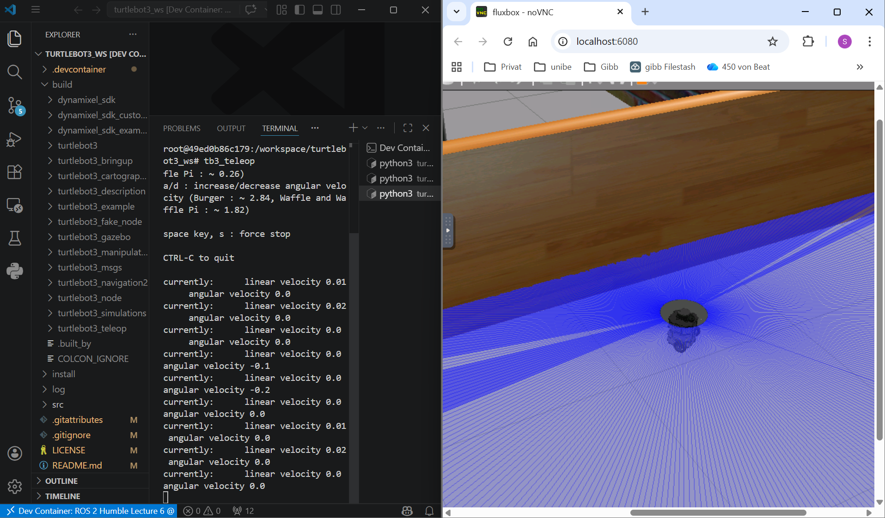

# Übungsblatt 06: ROS 2 Fundamentals: Topics, Nodes & Communication

[Link to repo](https://github.com/susifohn/lecture6-ros2demo/tree/main)

## Prerequisites
Following the readme went ok, but forgot to set the **GPU Passthrough**. Went through after the correction. 

Next the turtlebot house environment did not show up on *localhost:6080* just an empty world. After some desperate www search with no success, suddenly the house env did show up and the turtlebot was controllable.

