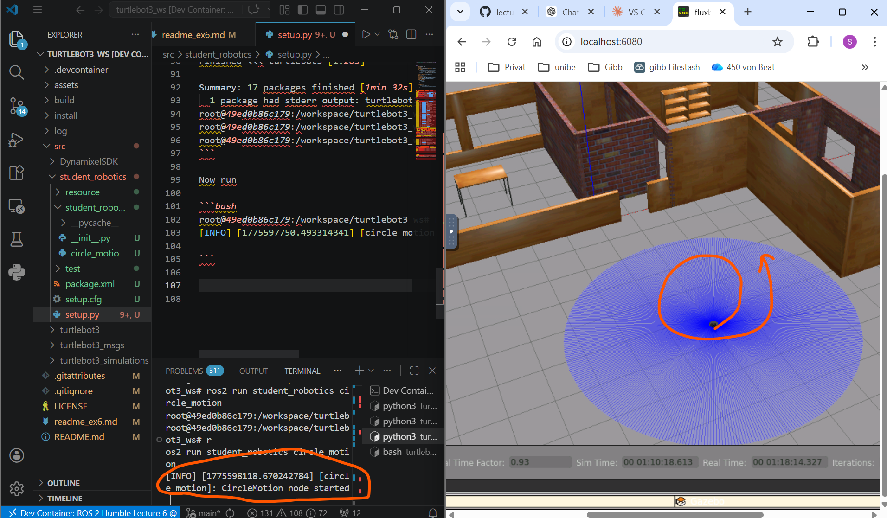
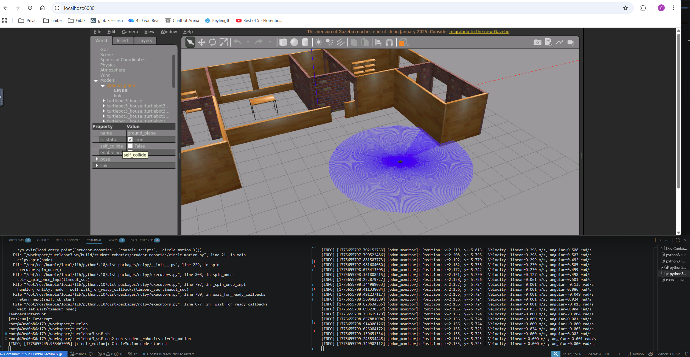
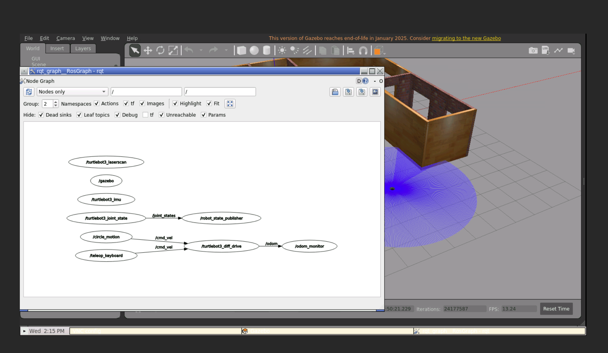

# Übungsblatt 06: ROS 2 Fundamentals: Topics, Nodes & Communication

[Link to repo](https://github.com/susifohn/lecture6-ros2demo/tree/main)

Name: Christian.Kissling@students.unibe.ch

Ros2 version. local 5.1.3

## Prerequisites
Following the readme went ok, but forgot to set the **GPU Passthrough**. Went through after the correction. 

Next the turtlebot house environment did not show up on *localhost:6080* just an empty world. After some desperate www search with no success, suddenly the house env did show up and the turtlebot was controllable.


## Aufgabe 1a

Do the following steps

```bash
root@49ed0b86c179:/workspace/turtlebot3_ws# cd /workspace/turtlebot3_ws/src

root@49ed0b86c179:/workspace/turtlebot3_ws/src# ls -al
total 0
drwxr-xr-x 1 root root 4096 Apr  3 17:53 .
drwxrwxrwx 1 root root 4096 Apr  7 20:51 ..
drwxr-xr-x 1 root root 4096 Apr  3 17:54 DynamixelSDK
drwxr-xr-x 1 root root 4096 Apr  3 17:53 turtlebot3
drwxr-xr-x 1 root root 4096 Apr  3 17:53 turtlebot3_msgs
drwxr-xr-x 1 root root 4096 Apr  3 17:53 turtlebot3_simulations
root@49ed0b86c179:/workspace/turtlebot3_ws/src# 
root@49ed0b86c179:/workspace/turtlebot3_ws/src# ros2 pkg create --build-type ament_python student_robotics
going to create a new package
package name: student_robotics
destination directory: /workspace/turtlebot3_ws/src
package format: 3
version: 0.0.0
description: TODO: Package description
maintainer: ['root <christian.kissling@students.unibe.ch>']
licenses: ['TODO: License declaration']
build type: ament_python
dependencies: []
creating folder ./student_robotics
creating ./student_robotics/package.xml
creating source folder
creating folder ./student_robotics/student_robotics
creating ./student_robotics/setup.py
creating ./student_robotics/setup.cfg
creating folder ./student_robotics/resource
creating ./student_robotics/resource/student_robotics
creating ./student_robotics/student_robotics/__init__.py
creating folder ./student_robotics/test
creating ./student_robotics/test/test_copyright.py
creating ./student_robotics/test/test_flake8.py
creating ./student_robotics/test/test_pep257.py

[WARNING]: Unknown license 'TODO: License declaration'.  This has been set in the package.xml, but no LICENSE file has been created.
It is recommended to use one of the ament license identitifers:
Apache-2.0
BSL-1.0
BSD-2.0
BSD-2-Clause
BSD-3-Clause
GPL-3.0-only
LGPL-3.0-only
MIT
MIT-0
root@49ed0b86c179:/workspace/turtlebot3_ws/src# 
root@49ed0b86c179:/workspace/turtlebot3_ws/src# cd student_robotics/
root@49ed0b86c179:/workspace/turtlebot3_ws/src/student_robotics# ls -al
total 8
drwxr-xr-x 1 root root 4096 Apr  7 21:07 .
drwxr-xr-x 1 root root 4096 Apr  7 21:07 ..
-rw-r--r-- 1 root root  652 Apr  7 21:07 package.xml
drwxr-xr-x 1 root root 4096 Apr  7 21:07 resource
-rw-r--r-- 1 root root  101 Apr  7 21:07 setup.cfg
-rw-r--r-- 1 root root  723 Apr  7 21:07 setup.py
drwxr-xr-x 1 root root 4096 Apr  7 21:07 student_robotics
drwxr-xr-x 1 root root 4096 Apr  7 21:07 test
root@49ed0b86c179:/workspace/turtlebot3_ws/src/student_robotics# 
```

Next is to add to the *package.xml* the following

```xml
<depend>rclpy</depend>
<depend>geometry_msgs</depend>
<depend>nav_msgs</depend>
```
Then create *circle_motion.py*  in the *student_robotics/student_robotics" directory with content:

```python
import rclpy
from rclpy.node import Node
from geometry_msgs.msg import Twist

class CircleMotion(Node):
    def __init__(self):
        super().__init__('circle_motion')
        self.publisher = self.create_publisher(Twist, '/cmd_vel', 10)
        self.timer = self.create_timer(0.1, self.timer_callback)  # 10 Hz
        self.get_logger().info('CircleMotion node started')

    def timer_callback(self):
        msg = Twist()
        msg.linear.x = 0.3   # m/s
        msg.angular.z = 0.5  # rad/s
        self.publisher.publish(msg)

def main(args=None):
    rclpy.init(args=args)
    node = CircleMotion()
    rclpy.spin(node)
    node.destroy_node()
    rclpy.shutdown()

if __name__ == '__main__':
    main()
```

Also make sure *setup.py* has the entry point registered:

```python
entry_points={
    'console_scripts': [
        'circle_motion = student_robotics.circle_motion:main',
    ],
},
```

Now build using the following aliases:
```bash
root@49ed0b86c179:/workspace/turtlebot3_ws# alias cb
alias cb='cd /workspace/turtlebot3_ws && colcon build --symlink-install --parallel-workers $(nproc)'
root@49ed0b86c179:/workspace/turtlebot3_ws# alias sb
alias sb='source /workspace/turtlebot3_ws/install/setup.bash'
root@49ed0b86c179:/workspace/turtlebot3_ws# 
```


```bash
root@49ed0b86c179:/workspace/turtlebot3_ws/src/student_robotics# cb
Starting >>> turtlebot3_msgs
Starting >>> dynamixel_sdk
Starting >>> turtlebot3_description                                                
Starting >>> dynamixel_sdk_custom_interfaces
Starting >>> turtlebot3_cartographer
Starting >>> turtlebot3_gazebo
Starting >>> turtlebot3_manipulation_gazebo
Starting >>> turtlebot3_navigation2
Finished <<< turtlebot3_cartographer [3.26s]                                                                           
Starting >>> turtlebot3_teleop
Finished <<< turtlebot3_description [5.16s]                                                            
Finished <<< turtlebot3_navigation2 [5.47s]                                                            
Starting >>> student_robotics
Finished <<< turtlebot3_teleop [10.0s]                                                                        
Finished <<< student_robotics [7.87s]                                                                         
Finished <<< dynamixel_sdk_custom_interfaces [13.9s]                                                          
Finished <<< turtlebot3_manipulation_gazebo [18.5s]                                                              
Finished <<< turtlebot3_msgs [19.3s]                                                                          
Starting >>> turtlebot3_example
Starting >>> turtlebot3_fake_node
Finished <<< turtlebot3_fake_node [4.09s]                                                                       
Finished <<< dynamixel_sdk [25.6s]                                                                              
Starting >>> turtlebot3_node
Starting >>> dynamixel_sdk_examples
Finished <<< turtlebot3_example [6.51s]                                                                      
Finished <<< turtlebot3_node [4.28s]                                                                                
Starting >>> turtlebot3_bringup
--- stderr: turtlebot3_gazebo                                                                                          
CMake Warning (dev) at /usr/share/cmake-3.22/Modules/FindPackageHandleStandardArgs.cmake:438 (message):
  The package name passed to `find_package_handle_standard_args` (PkgConfig)
  does not match the name of the calling package (gazebo).  This can lead to
  problems in calling code that expects `find_package` result variables
  (e.g., `_FOUND`) to follow a certain pattern.
Call Stack (most recent call first):
  /usr/share/cmake-3.22/Modules/FindPkgConfig.cmake:99 (find_package_handle_standard_args)
  /usr/lib/x86_64-linux-gnu/cmake/gazebo/gazebo-config.cmake:72 (include)
  CMakeLists.txt:23 (find_package)
This warning is for project developers.  Use -Wno-dev to suppress it.

---
Finished <<< turtlebot3_gazebo [35.5s]
Starting >>> turtlebot3_simulations
Finished <<< turtlebot3_bringup [5.95s]                                                                                 
Starting >>> turtlebot3
Finished <<< dynamixel_sdk_examples [10.8s]                                                                               
Finished <<< turtlebot3_simulations [1.44s]                                                                  
Finished <<< turtlebot3 [1.26s]                          

Summary: 17 packages finished [1min 32s]
  1 package had stderr output: turtlebot3_gazebo
root@49ed0b86c179:/workspace/turtlebot3_ws# 
root@49ed0b86c179:/workspace/turtlebot3_ws# sb
root@49ed0b86c179:/workspace/turtlebot3_ws# 
```

Now run

```bash
root@49ed0b86c179:/workspace/turtlebot3_ws# ros2 run student_robotics circle_motion
[INFO] [1775597750.493314341] [circle_motion]: CircleMotion node started

```

#### Note
I ad to manually move the bot away from the wall
in the house to prevent crashing and tilting. After 
there was enough space, the but 
moved in circles.



### Question: 
Why use create_timer?
### Answer
The create_timer is used to call timer_callback repeatedly at a fixed frequency.
Without it, the node would publish one single Twist message and stop. With the timer, it keeps publishing the velocity command continuously, which is necessary because Gazebo's robot controller expects a continuous stream of velocity commands.

## Aufgabe 1b

odom_monitor.py
```python
import rclpy
from rclpy.node import Node
from nav_msgs.msg import Odometry

class OdomMonitor(Node):
    def __init__(self):
        super().__init__('odom_monitor')
        self.subscription = self.create_subscription(
            Odometry,
            '/odom',
            self.odom_callback,
            10)
        self.get_logger().info('OdomMonitor node started')

    def odom_callback(self, msg):
        x = msg.pose.pose.position.x
        y = msg.pose.pose.position.y
        linear_x = msg.twist.twist.linear.x
        angular_z = msg.twist.twist.angular.z

        self.get_logger().info(
            f'Position: x={x:.3f}, y={y:.3f} | '
            f'Velocity: linear={linear_x:.3f} m/s, angular={angular_z:.3f} rad/s'
        )

def main(args=None):
    rclpy.init(args=args)
    node = OdomMonitor()
    rclpy.spin(node)
    node.destroy_node()
    rclpy.shutdown()

if __name__ == '__main__':
    main()
```
Add entry point to *setup.py*
```python
entry_points={
    'console_scripts': [
        'circle_motion = student_robotics.circle_motion:main',
        'odom_monitor = student_robotics.odom_monitor:main',  # ← add this
    ],
},
```

Then rebuild and start in two terminals:
```bash
cb
sb
ros2 run student_robotics odom_monitor   #this in terminal 1
ros2 run student_robotics circle_motion  #this in terminal 2
```

The Screenshot shows both terminals with the running processes:



Showing both nodes running:
```bash
root@49ed0b86c179:/workspace/turtlebot3_ws# ros2 node list 
/circle_motion
/gazebo
/odom_monitor
/robot_state_publisher
/teleop_keyboard
/turtlebot3_diff_drive
/turtlebot3_imu
/turtlebot3_joint_state
/turtlebot3_laserscan
root@49ed0b86c179:/workspace/turtlebot3_ws# 
```

### Question
How does pub-sub decoupling work?
### Answer
In ROS2, publishers and subscribers are completely independent — a publisher simply sends messages to a topic without knowing if anyone is listening, and a subscriber reads from that topic without knowing who is sending. This decoupling means nodes can be started, stopped, or restarted in any order without breaking the system — for example circle_motion can publish to /cmd_vel even if odom_monitor isn't running yet. The topic acts as the middleman, allowing multiple publishers and subscribers to connect to the same channel simultaneously, making it easy to add new nodes (like a logger or visualizer) without modifying any existing code.

## Aufgabe 2

### ros2 topic list
```bash
root@49ed0b86c179:/workspace/turtlebot3_ws# ros2 topic list 
/clock
/cmd_vel
/imu
/joint_states
/odom
/parameter_events
/performance_metrics
/robot_description
/rosout
/scan
/tf
/tf_static
root@49ed0b86c179:/workspace/turtlebot3_ws# 
```

### ros2 topic info /cmd_vel
```bash
root@49ed0b86c179:/workspace/turtlebot3_ws# ros2 topic info /cmd_vel
Type: geometry_msgs/msg/Twist
Publisher count: 2
Subscription count: 1
root@49ed0b86c179:/workspace/turtlebot3_ws# 
```

### ros2 topic hz /odom
```bash
root@49ed0b86c179:/workspace/turtlebot3_ws# ros2 topic hz /odom
average rate: 26.898
        min: 0.034s max: 0.043s std dev: 0.00201s window: 28
average rate: 27.141
        min: 0.031s max: 0.050s std dev: 0.00324s window: 56
average rate: 27.346
        min: 0.031s max: 0.050s std dev: 0.00305s window: 84
average rate: 27.200
        min: 0.031s max: 0.050s std dev: 0.00307s window: 111
average rate: 27.051
        min: 0.031s max: 0.050s std dev: 0.00339s window: 138
average rate: 27.075
```

### ros2 node list
```bash
^Croot@49ed0b86c179:/workspace/turtlebot3_ws# ros2 node list
/circle_motion
/gazebo
/odom_monitor
/robot_state_publisher
/teleop_keyboard
/turtlebot3_diff_drive
/turtlebot3_imu
/turtlebot3_joint_state
/turtlebot3_laserscan
root@49ed0b86c179:/workspace/turtlebot3_ws# 
```
### Question
What is /odom frequency? Why does frequency matter for robot control?
### Answer
The /odom topic is typically published at 30-50 Hz by the TurtleBot3, which you can verify with ros2 topic hz /odom. Frequency matters for robot control because a higher rate means more up-to-date position data, allowing the controller to react faster and more accurately to changes — too low a frequency causes the robot to overshoot or behave erratically. For cmd_vel, publishing too slowly risks the robot stopping due to the safety timeout, while publishing too fast wastes CPU resources.

### Question
How many publishers and subscribers does /cmd_vel have when your nodes are
running? List them.
### Answer
Same as above. 
- Publisher count: 2
- Subscription count: 1

### Question
What’s the difference between ros2 topic hz and ros2 topic bw? (2 sentences)
### Answer
ros2 topic hz measures the publishing frequency (how many messages per second arrive on a topic), while ros2 topic bw measures the bandwidth (how many bytes per second are being transmitted). For /odom, hz tells you how often the robot updates its position estimate, while bw tells you the data size cost — useful when optimizing network usage in multi-robot or real hardware deployments.

## Aufgabe 2b



### Question
What does the graph show? How are nodes connected? (2-3 sentences)
### Answer
The graph shows that circle_motion publishes velocity commands to /cmd_vel, which is consumed by the TurtleBot3 differential drive controller to physically move the robot. The controller then publishes the resulting robot position and velocity to /odom, which odom_monitor subscribes to in order to log the data. This visualizes the classic sense-act loop in robotics: a node commands motion, the robot acts, and another node monitors the outcome — all connected purely through topics with no direct node-to-node communication.

### Question
What happens if you stop the circle_motion node? Does odom_monitor still
work? Why? (2 sentences)
### Answer
If you stop circle_motion, the robot will stop moving (no more /cmd_vel messages) but odom_monitor keeps running and continues logging — it will just show position and velocity values of zero. This demonstrates pub-sub decoupling: odom_monitor is completely independent of circle_motion and only cares about the /odom topic, not about who or what is causing the robot to move.
